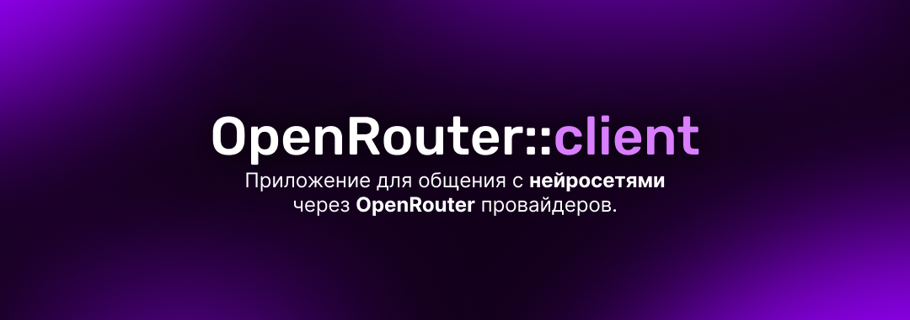
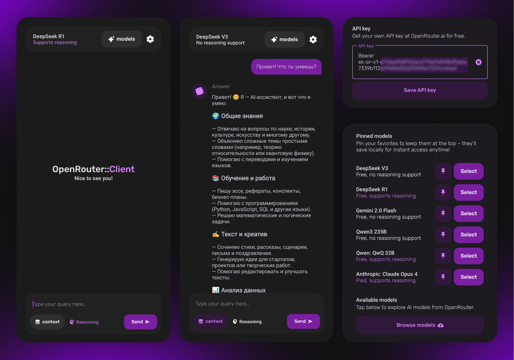
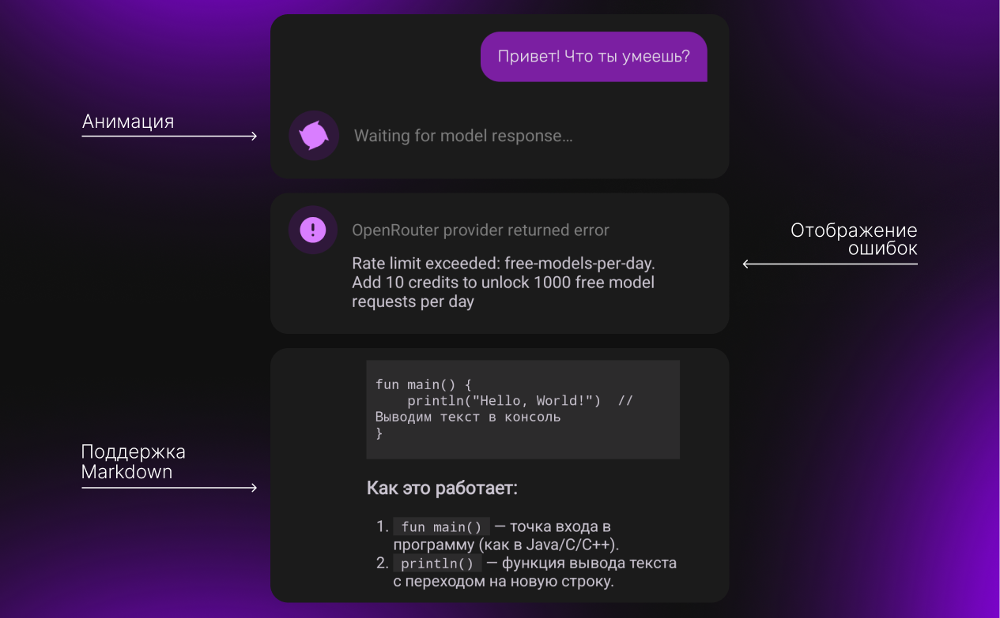
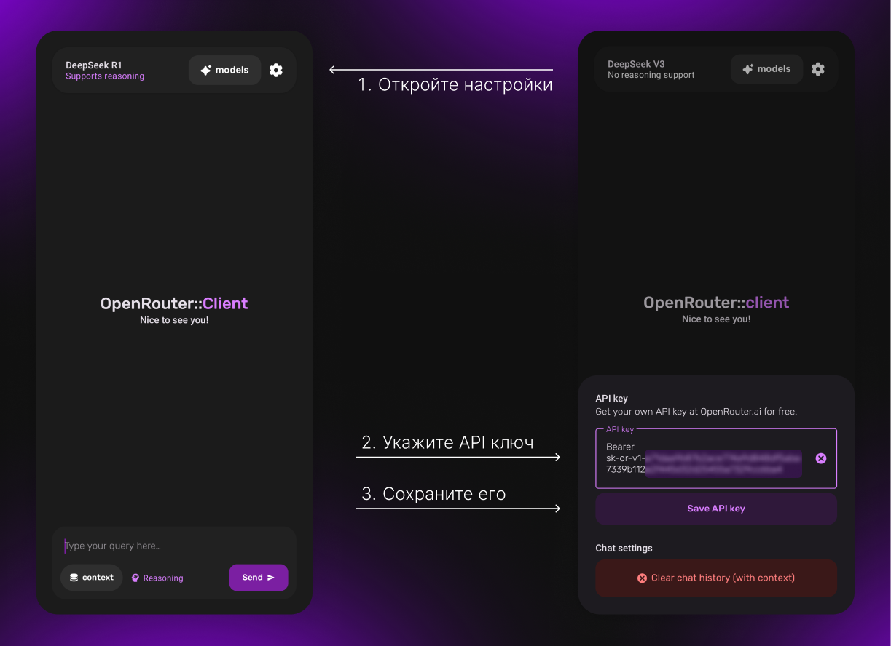

[English](README.md) | **Русский**



**OpenRouter::client** — Android-приложение для общения с нейросетями через сервис [OpenRouter.ai](https://openrouter.ai/). <br>Проект разработан в **учебных целях** для закрепления  навыков.

## Возможности

- Отправка запросов в нейросеть через OpenRouter API
- Выбор и сохранение в избранное AI-моделей из каталога OpenRouter
- **Поддержка бесплатных моделей** — фильтрация и использование бесплатных моделей (например, `qwen/qwen3.6-plus:free`) без каких-либо затрат
- **Двуязычный интерфейс** — переключение между английским и русским в настройках
- Переключение режима контекста (использование истории чата в запросе)
- Сохранение истории сообщений в виде чата
- Использование кастомного API-ключа
- Очистка истории чата
- Подробные сообщения об ошибках — видите реальное сообщение вместо общего "проверьте подключение"

## Скриншоты




## Архитектура

Проект построен по принципам **Clean Architecture** и разделён на слои:

- **Presentation** (UI, Activity, Fragments, ViewModels)
- **Domain** (UseCases, Entities, Repository interfaces)
- **Data** (Room, Retrofit, Repositories, Mappers)
- **DI** (Component, Modules, Scope, Qualifiers)

Реализован MVVM-паттерн (ViewModel + Flow).<br>
Dependency Injection через Hilt.

## Технологический стек

- **Kotlin**, **Android SDK**, **Coroutines**, **Flow**, **ViewBinding**
- **Room** (хранение истории чата и избранных AI-моделей)
- **Retrofit2** (сетевые запросы к OpenRouter API)
- **Hilt** (внедрение зависимостей)
- **Markwon** (рендеринг markdown)

## Сборка и запуск

1. Склонируйте репозиторий:
```bash
  git clone https://github.com/qrconsult/open-router-android.git
  cd open-router-android
```

2. Соберите проект через Gradle:

```bash
  ./gradlew assembleDebug
```

   Или откройте в Android Studio и используйте **Build → Build Bundle(s) / APK(s) → Build APK(s)**.

3. APK будет находиться в `app/build/outputs/apk/debug/app-debug.apk`

4. Добавьте свой OpenRouter API-ключ:
   - Перейдите на сайт [OpenRouter.ai](https://openrouter.ai/) и зарегистрируйтесь.
   - Создайте новый API-ключ в [настройках профиля](https://openrouter.ai/settings/keys).
   - Укажите его в настройках приложения:


